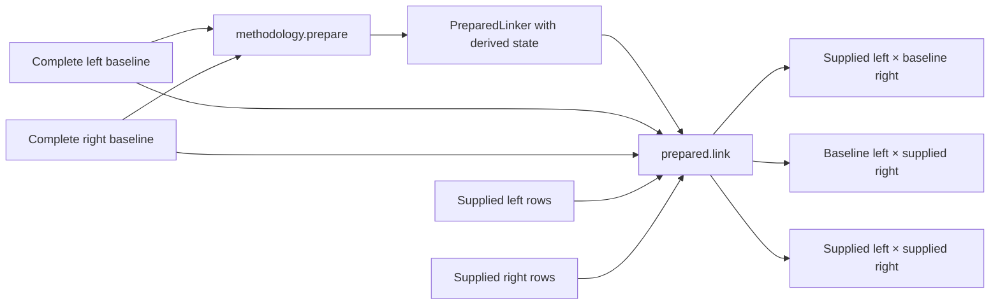

# Custom methodologies

A methodology is the pluggable class a step runs. matchlab ships one for every kind of step. To write one, subclass a base, declare settings as fields, implement its methods, and register the class.

```python
from typing import ClassVar

import matchlab as mb
import polars as pl


class Initials(mb.Transformer):
    """Reduce a name to its initials."""

    version: ClassVar[int] = 1

    column: str

    def apply(
        self, prepared_state: object, data: pl.DataFrame, *, baseline: pl.DataFrame
    ) -> pl.DataFrame:
        initials = pl.col(self.column).str.extract_all(r"\b\w").list.join("")
        return data.with_columns(initials.alias("initials"))


mb.add_transformer_class(Initials)
```

The base you subclass depends on the step. `Transformer` reshapes a record step. `Deduper` and `Linker` score candidate matches. `ResolverMethod` turns edges into clusters, and `Location` reads rows into a source.

## Preparation and execution

A methodology is a stable Pydantic specification. Its settings describe what to run; `prepare()` returns a separate object containing derived runtime state. Preparation must not change the methodology or its input frames.

Each family returns its own prepared type and keeps its usual action name:

| Methodology | Preparation returns | Prepared action |
| --- | --- | --- |
| `Transformer` | `PreparedTransformer` | `apply(data, *, baseline)` |
| `Deduper` | `PreparedDeduper` | `dedupe(data, *, baseline)` |
| `Linker` | `PreparedLinker` | `link(left=None, right=None, *, baseline_left, baseline_right)` |
| `ResolverMethod` | `PreparedResolverMethod` | `compute_clusters(model_edges, *, baseline_model_edges)` |

The prepared action delegates to the methodology's public action, passing its stored `state` as the first argument. Methodologies without setup can inherit the default `prepare()`, which returns a prepared object with `state=None`, as `Initials` does above. Override it when you need trained parameters, term frequencies, an index, or another derived object:

```python
class Centred(mb.Transformer):
    """Centre values using the mean of the complete baseline."""

    version: ClassVar[int] = 1
    column: str

    def prepare(self, data: pl.DataFrame) -> mb.PreparedTransformer:
        mean = data[self.column].mean()
        if mean is None:
            raise ValueError("A baseline with numeric values is required")
        return mb.PreparedTransformer(methodology=self, state=float(mean))

    def apply(
        self, prepared_state: float, data: pl.DataFrame, *, baseline: pl.DataFrame
    ) -> pl.DataFrame:
        return data.with_columns(
            (pl.col(self.column) - prepared_state).alias(self.column)
        )
```

You still write one methodology class. The prepared type supplies the delegation. Baseline frames are explicit action arguments; they are not hidden inside the prepared object. A backend such as Splink can retain its own input tables as part of the derived state it needs to score records.

For a linker, preparation receives the complete left and right baselines. Rows supplied to the prepared `link()` action are additions or previews. The action scores these three combinations when both sides are supplied:



```python
prepared = linker.prepare(baseline_left, baseline_right)
edges = prepared.link(
    new_left,
    new_right,
    baseline_left=baseline_left,
    baseline_right=baseline_right,
)
```

Every returned pair involves a supplied row. The baselines remain unchanged. During collection, both supplied sides are the complete baselines, producing the complete result. A deduper similarly scores supplied rows against its explicit baseline and against each other.

Use the baselines that produced the prepared state. One methodology can be prepared against different baselines; each returned object remains usable independently. Prepared objects may contain backend objects that cannot be serialised.

### Step lifecycle and Store caching

The owning step obtains complete collected inputs, prepares once, retains the returned object in memory, and calls its action with explicit baselines. Repeated actions can reuse that preparation. A newly built step starts without a prepared object.

A Store cache hit returns the collected output without preparing. If a later action needs preparation, the step rebuilds it from the stored input baselines and retains it then. A refreshed execution replaces the old preparation. Prepared state contributes nothing to settings, fingerprints, or plan documents, and this feature does not persist it in the Store.

Each registry is keyed by class name, which is how a [plan document](./serialise.md) names your class.

## Settings and resources

Every field you declare is a setting. Settings are serialised into the step's [fingerprint](../glossary.md#fingerprint), so editing one re-runs the step and everything below it.

Anything that cannot be serialised is a resource instead. Mark the field and pass it in `*_resources`:

```python
class Lookup(mb.Transformer):
    column: str  # a setting
    engine: mb.FromResources[Engine]  # a resource
```

Each field is checked against its own declaration. Passing one in the wrong argument raises, naming the field:

```
ResourceError: 'engine' on Lookup is a setting, not a resource, so must be passed in
`transformer_settings`. Only a field marked `FromResources` may go in
`transformer_resources`.
```

## Declaring a version

A fingerprint covers your settings. It does not cover the code those settings run. Edit `prepare` or `apply` and nothing in the key moves, so `collect()` hands back whatever the old code produced.

`version` is how you close that gap, and it is a promise:

> This class computes a deterministic function of its settings.

Make that promise and matchlab caches what you produce. Count the version up by one whenever you change what the class computes. That retires every artifact the old code wrote.

Leave `version` unset and you promise nothing. matchlab knows nothing about your code, so it refuses to trust a stored artifact. The step re-runs on every collect, and so does every step below it. Edit the class, run again, and you see the new result.

That is why an unset version is the default. It is also what you want while a methodology is still moving:

```
↻ [2] model(NaiveDeduper) refreshed 1.4s
    └── ↻ [1] transform(Initials) refreshed 0.2s
        └── ◍ [0] source 'crn' cached
```

`refreshed` says the step ran because it cannot be cached. It does not mean your edit invalidated it. Step 2 is refreshed because step 1 is. A step that may produce something new leaves nothing below it worth trusting.

Declare `version` as a class attribute, never as a field:

```python
version: ClassVar[int] = 1  # correct
version: int = 1  # a setting called "version", which is not the same thing
```

The second form is a setting. matchlab raises rather than letting it pass for a promise.

## Pitfalls

Each of these makes a methodology depend on something its settings do not describe. Leave `version` unset until you have fixed the cause.

!!! warning "A resource that changes the output"

    A resource never reaches a fingerprint. Pass a lookup table or a fitted model as one, and two runs against different data share a key. The second reads back the first's result. Move the input into settings, read it through a [source](../glossary.md#source) so its rows are hashed, or declare no version.

!!! warning "Sampling without a seed"

    A methodology that samples is not a function of its settings. `SplinkLinker` training functions such as `estimate_u_using_random_sampling` need a `seed` in their arguments. Without one, the first result is cached and every later run reads it back.

Three more are easy to miss.

* **Ambient state.** A library version, a locale, a clock. Upgrade a dependency your methodology calls and the same settings give a different answer under the same key. Bump your version when you upgrade.
* **Mutating your own settings.** A methodology's settings are hashed when the step is built. Writing to them afterwards changes what runs and not what was hashed. Copy at the boundary if a library you wrap mutates what you hand it.
* **Two classes with one name.** A step is identified by its methodology's class name. Two classes called `Normalise` therefore share a fingerprint while computing different things. Names have to be unique across a codebase, not just a module.

Dict settings are ordered, and that order is part of the key. `Clean` and `Group` project their entries in the order you wrote them, so reordering them is a real edit and re-runs the step.

A transformer must also pass `id` through untouched. Every model matches on it, and matchlab derives it from record content. A transformer that writes to it changes which records count as the same:

```
ValueError: `id` is not a column you can write. It is the grouping every model matches
on, derived from record content, so replacing it would silently change which records
count as the same. Give the expression another name.
```

## What an unset version costs

Everything below an unversioned step re-runs too. The expensive steps are usually the ones below. A cheap transformer near the top of a plan can mean re-running a linker on every collect.

Each run stores its own artifact rather than replacing the last. That is what keeps a published label pointing at the result you published. It also means the store grows by one artifact per refreshed step per run. Prune it as you go:

```python
store.prune(keep=plan.fingerprints())
```

Set a version once your methodology settles, then bump it when the code changes. That gets the caching back without asking matchlab to take your code on trust.
